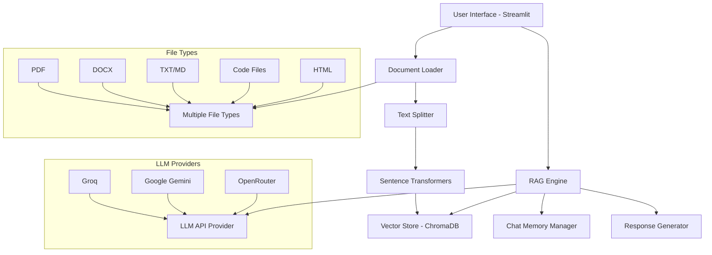
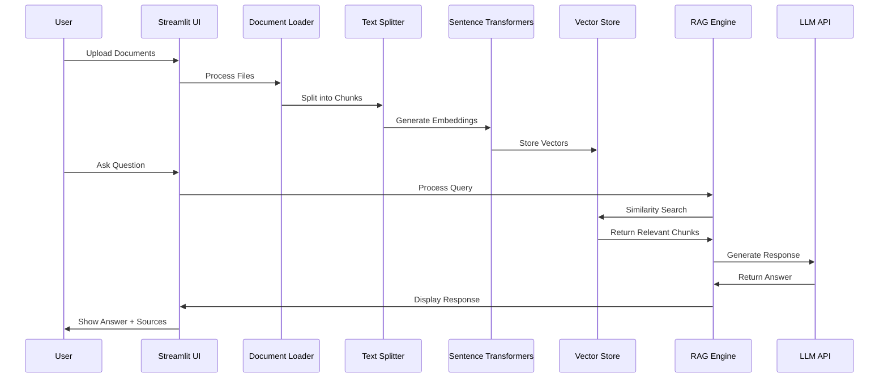

# Enhanced RAG System with Sentence Transformers

[](https://python.org)
[](https://streamlit.io)
[](https://langchain.com)
[](LICENSE)

Một hệ thống RAG (Retrieval-Augmented Generation) tiên tiến sử dụng Sentence Transformers cho embedding và API LLM cho việc sinh text. Hỗ trợ đa dạng loại file và cung cấp giao diện web trực quan.

## 🚀 Tính năng chính

- **Đa dạng loại file**: PDF, DOCX, TXT, MD, PY, HTML, CSS, JS
- **Embedding tiên tiến**: Sử dụng Sentence Transformers cho vector embeddings chất lượng cao
- **API LLM linh hoạt**: Hỗ trợ Groq, Google Gemini, OpenRouter
- **Giao diện thân thiện**: Web UI với Streamlit
- **Quản lý lịch sử**: Lưu và khôi phục các phiên chat
- **Tìm kiếm thông minh**: Vector search với điều chỉnh threshold
- **Theo dõi nguồn**: Hiển thị nguồn thông tin cho mỗi câu trả lời

## 🏗️ Kiến trúc hệ thống

### Tổng quan kiến trúc



### Luồng xử lý dữ liệu



## 🔧 Công nghệ sử dụng

### Core Technologies

| Công nghệ | Phiên bản | Mục đích |
|-----------|-----------|----------|
| **Python** | 3.8+ | Ngôn ngữ lập trình chính |
| **Streamlit** | 1.28+ | Giao diện web và UI components |
| **LangChain** | 0.1+ | Framework cho LLM applications |
| **Sentence Transformers** | Latest | Tạo embeddings chất lượng cao |
| **ChromaDB** | Latest | Vector database cho similarity search |

### Document Processing

| Library | Mục đích |
|---------|----------|
| **PyPDF** | Xử lý file PDF |
| **python-docx** | Đọc file Word documents |
| **Unstructured** | Xử lý HTML, Markdown |
| **TextLoader** | Xử lý code files và plain text |

### LLM API Providers

| Provider | Models | API Key Required |
|----------|--------|------------------|
| **Groq** | Llama, Mixtral, Gemma | `GROQ_API_KEY` |
| **Google** | Gemini Pro, Gemini Flash | `GOOGLE_API_KEY` |
| **OpenRouter** | Multiple models | `OPENROUTER_API_KEY` |

## 📦 Cài đặt

### Prerequisites

- Python 3.8 hoặc cao hơn
- Git
- API key từ một trong các providers (Groq, Google, OpenRouter)

### Bước 1: Clone repository

```bash
git clone https://github.com/your-username/enhanced-rag-system.git
cd enhanced-rag-system
```

### Bước 2: Tạo virtual environment

```bash
# Windows
python -m venv venv
venv\Scripts\activate

# Linux/Mac
python3 -m venv venv
source venv/bin/activate
```

### Bước 3: Cài đặt dependencies

```bash
pip install -r requirements.txt
```

### Bước 4: Cấu hình environment variables

Tạo file `.env` trong thư mục gốc:

```env
# Chọn một LLM provider
LLM_PROVIDER=groq
MODEL_NAME=llama3-70b-8192

# API Keys (chọn provider tương ứng)
GROQ_API_KEY=your_groq_api_key_here
GOOGLE_API_KEY=your_google_api_key_here
OPENROUTER_API_KEY=your_openrouter_api_key_here
```

### Bước 5: Tạo file cấu hình

**config.json:**
```json
{
  "embedding_model": "all-MiniLM-L6-v2",
  "chunk_size": 1024,
  "chunk_overlap": 100,
  "pipeline": "sentence_transformer_api"
}
```

**prompt.json:**
```json
{
  "prompt_template": "You are a helpful AI assistant with expertise in analyzing documents. Use the following context to answer the user's question accurately and comprehensively.\n\nContext from documents:\n{context}\n\nPrevious conversation:\n{chat_history}\n\nUser Question: {question}\n\nPlease provide a detailed and accurate answer based on the context provided. If the context doesn't contain enough information to answer the question completely, please state that clearly and suggest what additional information might be needed."
}
```

## 🚀 Sử dụng

### Khởi chạy ứng dụng

```bash
streamlit run app_main.py
```

Truy cập `http://localhost:8501` để sử dụng ứng dụng.

### Hướng dẫn sử dụng

#### 1. Upload Documents
- Sử dụng sidebar để upload các file
- Hỗ trợ: PDF, DOCX, TXT, MD, PY, HTML, CSS, JS
- Có thể upload nhiều file cùng lúc
- Hệ thống sẽ tự động phân tích và tạo embeddings

#### 2. Cấu hình Parameters
- **Number of Retrieved Results (k)**: Số lượng đoạn text liên quan được truy xuất (1-15)
- **Similarity Score Threshold**: Ngưỡng độ tương đồng (0.0-1.0)
  - Cao hơn = kết quả chính xác hơn nhưng ít hơn
  - Thấp hơn = nhiều kết quả hơn nhưng có thể kém liên quan

#### 3. Chat Interface
- Nhập câu hỏi trong ô text input
- Hệ thống sẽ:
  - Tìm kiếm thông tin liên quan trong documents
  - Sinh câu trả lời sử dụng LLM API
  - Hiển thị nguồn thông tin
  - Lưu lịch sử conversation

#### 4. Quản lý Session
- **Save Session**: Lưu cuộc trò chuyện hiện tại
- **Load Session**: Khôi phục cuộc trò chuyện đã lưu
- **Clear Chat**: Xóa lịch sử chat hiện tại

## 🔍 Chi tiết kỹ thuật

### Xử lý Documents

```python
# Document loading pipeline
Document Upload → File Type Detection → Appropriate Loader Selection → 
Text Extraction → Chunking → Embedding Generation → Vector Storage
```

### RAG Pipeline

```python
# Query processing pipeline
User Query → Similarity Search → Context Retrieval → 
Prompt Construction → LLM API Call → Response Generation → 
Source Attribution → Memory Update
```

### Vector Search

- **Embedding Model**: Sentence Transformers (configurable)
- **Vector Store**: ChromaDB với persistent storage
- **Search Type**: Cosine similarity
- **Filtering**: Score threshold và top-k results

### Memory Management

- **Conversation Buffer**: Lưu trữ lịch sử chat gần đây
- **Session Persistence**: JSON-based storage
- **Context Window**: Configurable window size cho conversation context

## 📁 Cấu trúc project

```
enhanced-rag-system/
├── app_main.py                          # Main Streamlit application
├── rag_sentence_transformer_api.py     # Enhanced RAG engine
├── document_loader.py                  # Multi-format document processing
├── chat_memory.py                      # Conversation memory management
├── chat_history.py                     # Session persistence
├── document_summarizer.py              # Document summarization
├── llm_providers.py                    # LLM API integrations
├── requirements.txt                    # Python dependencies
├── config.json                         # System configuration
├── prompt.json                         # Prompt templates
├── .env                               # Environment variables
├── README.md                          # This file
└── chat_history/                      # Stored chat sessions
    ├── session_20241201_143022.json
    └── ...
```

## ⚙️ Cấu hình nâng cao

### Custom Embedding Models

Sửa `config.json` để sử dụng embedding model khác:

```json
{
  "embedding_model": "sentence-transformers/paraphrase-multilingual-MiniLM-L12-v2",
  "chunk_size": 1024,
  "chunk_overlap": 100
}
```

### Tùy chỉnh Prompts

Chỉnh sửa `prompt.json` để tùy chỉnh cách LLM phản hồi:

```json
{
  "prompt_template": "Your custom prompt template here with {context}, {chat_history}, and {question} placeholders"
}
```

### LLM Provider Configuration

Cấu hình chi tiết trong `.env`:

```env
# Groq Configuration
LLM_PROVIDER=groq
MODEL_NAME=mixtral-8x7b-32768
GROQ_API_KEY=your_key

# Google Configuration  
LLM_PROVIDER=google
MODEL_NAME=gemini-pro
GOOGLE_API_KEY=your_key

# OpenRouter Configuration
LLM_PROVIDER=openrouter
MODEL_NAME=openai/gpt-4-turbo
OPENROUTER_API_KEY=your_key
```

## 🐛 Troubleshooting

### Lỗi thường gặp

1. **ModuleNotFoundError**: 
   ```bash
   pip install -r requirements.txt
   ```

2. **API Key errors**:
   - Kiểm tra file `.env` và API keys
   - Đảm bảo provider được cấu hình đúng

3. **Memory issues với large documents**:
   - Giảm `chunk_size` trong config.json
   - Tăng `score_threshold` để filter kết quả

4. **ChromaDB persistence errors**:
   ```bash
   # Xóa database cũ
   rm -rf chroma_db_sentence_transformer_api
   ```

### Performance Optimization

- **Tăng chunk_size**: Xử lý nhanh hơn nhưng ít precise
- **Giảm retrieval_k**: Ít context nhưng response nhanh hơn
- **Sử dụng embedding model nhỏ hơn**: Trade-off giữa quality và speed

## 🤝 Contributing

1. Fork repository
2. Tạo feature branch (`git checkout -b feature/AmazingFeature`)
3. Commit changes (`git commit -m 'Add some AmazingFeature'`)
4. Push to branch (`git push origin feature/AmazingFeature`)
5. Mở Pull Request

## 📄 License

Distributed under the MIT License. See `LICENSE` for more information.

## 📞 Support

- 🐛 **Bug Reports**: [GitHub Issues](https://github.com/ngoquytuan/enhanced-rag-system/issues)
- 💬 **Discussions**: [GitHub Discussions](https://github.com/ngoquytuan/enhanced-rag-system/discussions)
- 📧 **Email**: ngoquytuan@gmail.com

## 🙏 Acknowledgments

- [LangChain](https://langchain.com) - Framework for LLM applications
- [Streamlit](https://streamlit.io) - Web application framework
- [Sentence Transformers](https://www.sbert.net) - Embedding models
- [ChromaDB](https://www.trychroma.com) - Vector database
- [Hugging Face](https://huggingface.co) - ML model hub

---

⭐ **Star repository nếu project hữu ích cho bạn!**
